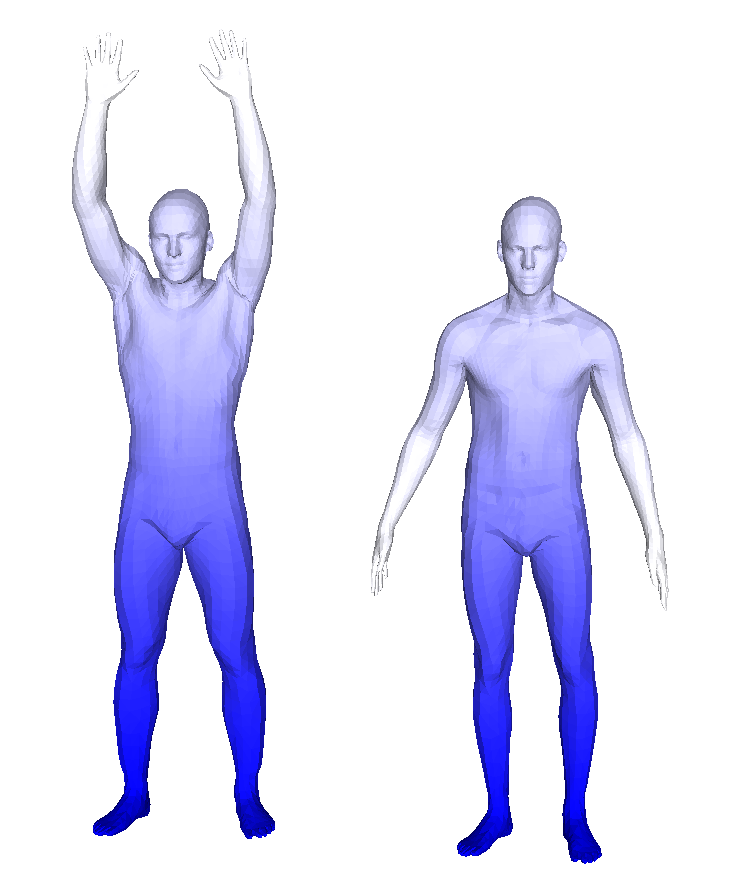
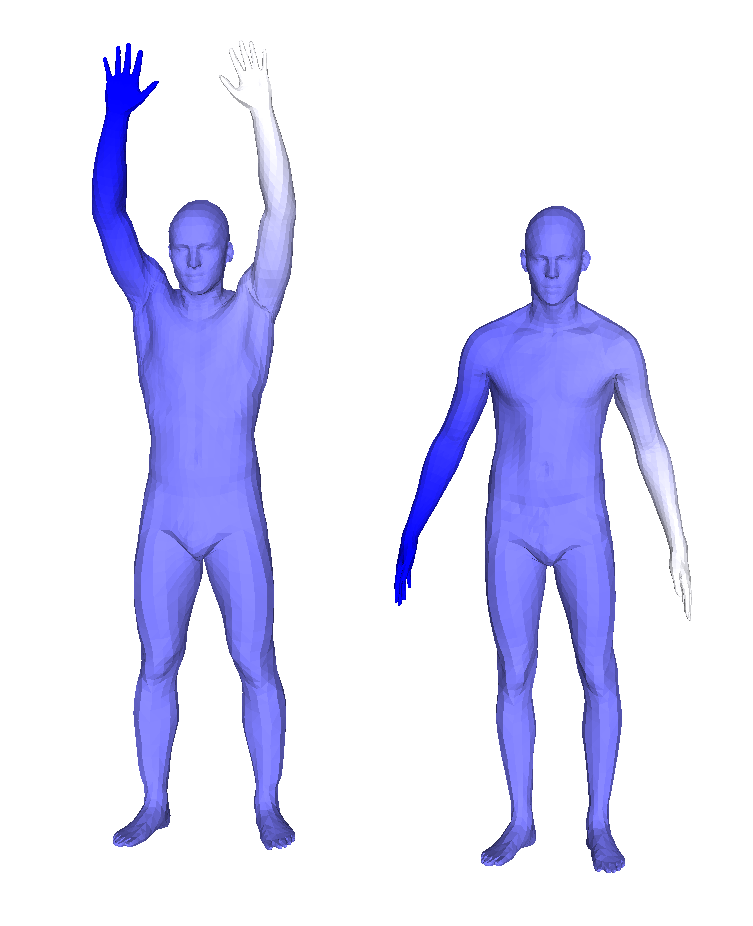
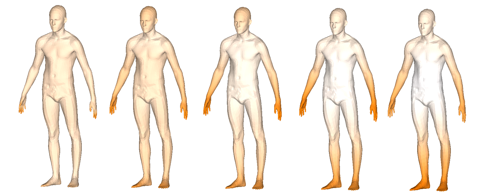

# openmesh_painter
> Author: Jeonghyun Kim 
> Date: 08-Dec-2021

Mesh painter using OpenMesh for CS492D, KAIST (Prof. M. Sung)

## Requirements
```
OpenMesh
Eigen
```

## Description
1. Take function matrix `_vectors` and column `_c` (e.g. index of LBO, timestep for HKS) to draw. 
2. Normalize function values to color domain (0~255).
3. Colorize face of mesh with averaged function value of its vertices. 
4. *Modify `out_file` to your designated output path*
5. Write file to `out_file` path.
6. Pass them to MeshLab.

## Examples
*(Please note that I'm not sure if figures below are correct results for HW5 ^^;)*  

**LB operator** (source_9.obj, target.obj)<br>
 

**HKS** (target.obj) <br>

